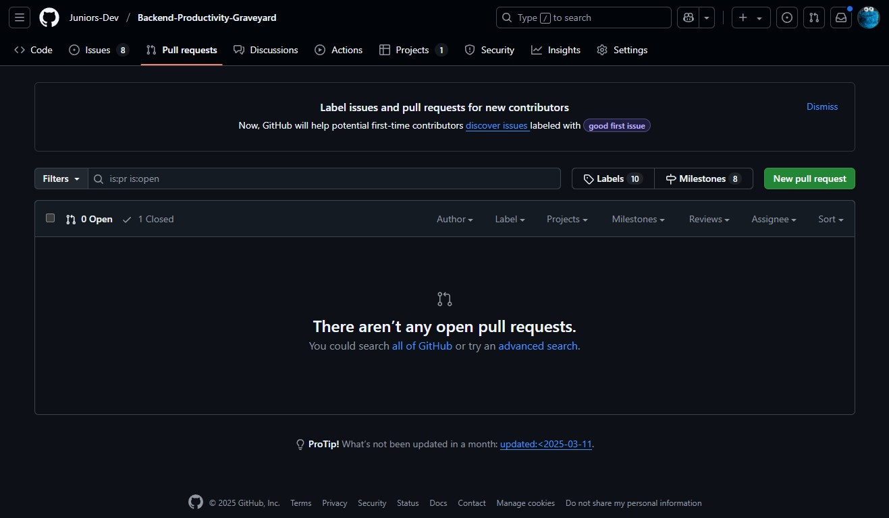
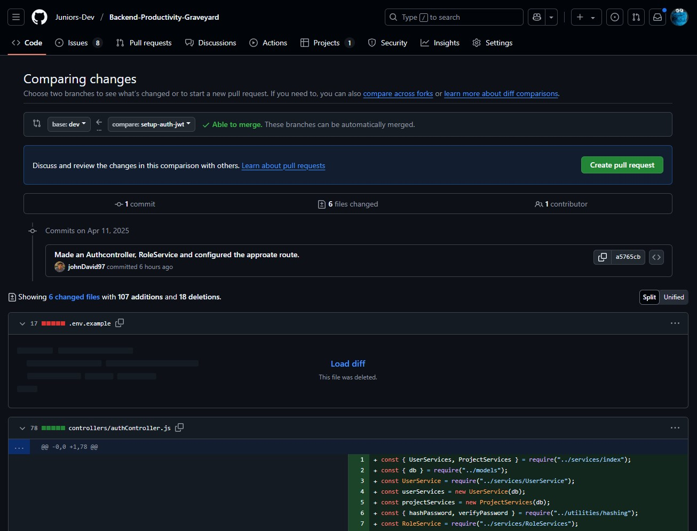
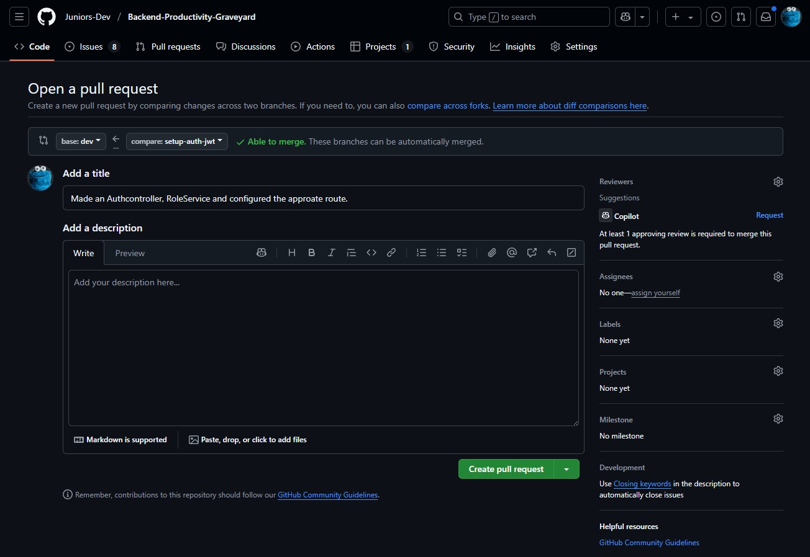
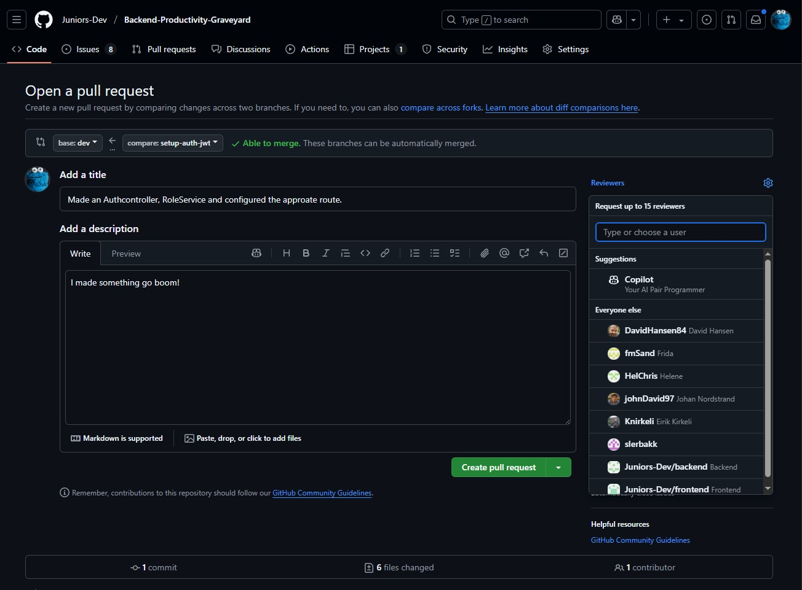
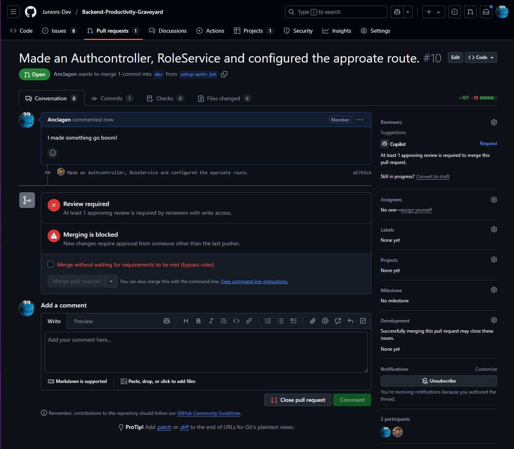
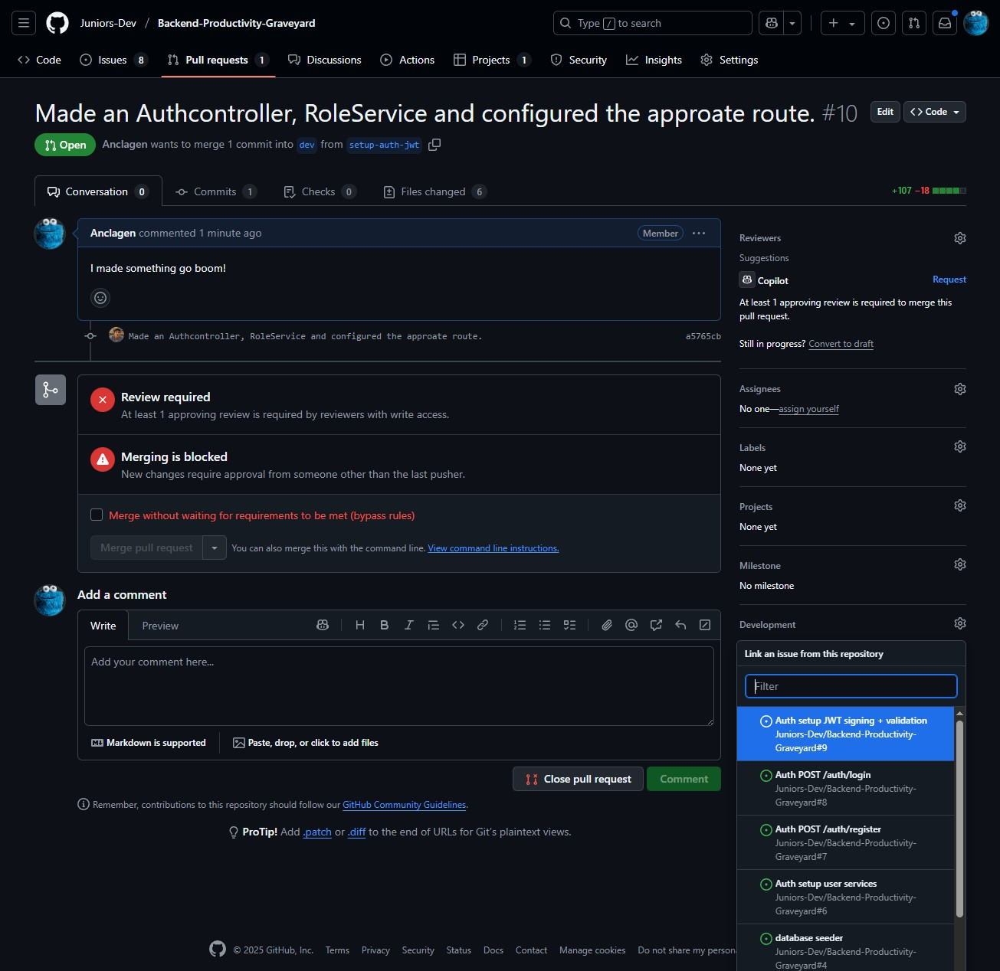

# VSC & Github

## Using Git in the Terminal

The simple stuff in the terminal, although I advise installing GitLens for VSCode to make it easier to use Git with a visual interface for checking out changes, branches, etc. I typically use a bit of both, but I find the terminal easier for some things.

> 💡 **Git Cheat Sheet**
> Stuff you will use all the time:
>
> - `git status` – what's changed
> - `git add <file-name>` – stage a specific file
> - `git add .` – stage all files
> - `git commit -m "commit message"` – commit changes
> - `git push` – send current branches committed changes to GitHub
> - `git pull` – sync local branch with remote branch
> - `git branch` – list branches
> - `git checkout -b feature/xyz` – create new branch
> - `git push --set-upstream origin feature/xyz` – push new branch to remote
> - `git merge main` – bring updates into your current branch

### 1. Clone a Repository

```bash
git clone <repository-url>
cd <repository-name>
code . # Open the repository in VSCode
```

### 2. Check the Status of Your Repository

```bash
git status
```

### 3. Add Files to Staging Area

```bash
git add <file-name> # Add a specific file
git add . # Add all files
```

### 4. Commit Changes

```bash
git commit -m "Your commit message" # Always write a message to describe the changes made
```

### 5. Push Changes to Remote Repository

```bash
git push origin <branch-name> # Push to a specific branch
git push # Push to the current branch
```

### 6. Pull Changes from Remote Repository

Make sure to regularly pull changes from the remote repository to keep your local copy up to date. This is especially important when working in a team on the same project.

```bash
git pull origin <branch-name> # Pull from a specific branch
git pull # Pull from the current branch.
```

### 7. Create a New Branch

You can select an issue on github and create a new branch for it. But you can also do it locally and then push it to the remote repository.

```bash
git branch <new-branch-name> # Create a new branch without switching to it
git checkout -b <new-branch-name> # Create and switch to a new branch
git push --set-upstream origin <new-branch-name> # Push the new branch to the remote repository
```

### 8. Switch to an Existing Branch

This is useful when you want to work on a different feature or bug fix.

```bash
git checkout <branch-name> # Switch to an existing branch
```

### 9. Merge Branches

This is useful when working collaboratively. As you work other feature might get added to the main and dev branches. You can merge those changes into your branch to keep it up to date, and ensure you current changes are compatible with the latest changes.

```bash
git checkout <target-branch> # Switch to the branch you want to merge into
git merge <source-branch> # Merge the source branch into the target branch
```

### 10. Delete a Branch

Once your branch has been merged typically you delete it in the Pull Request. But you can also delete it locally and remotely.

```bash
git branch -d <branch-name> # Delete a local branch
git push origin --delete <branch-name> # Delete a remote branch
```

### 11. View Commit History

You can view the commit history to see all the changes made to the repository. This is useful for tracking changes and understanding the project’s evolution. I prefer to use the GitLens extension for this to view the history and a graphical representation of the commits.

```bash
git log # View commit history
git log --oneline # View a simplified commit history
git log --graph --oneline --decorate # View a graphical representation of the commit history
```

### 12. Stash Changes

If you have uncommitted changes that you want to temporarily set aside, you can use the stash command. This is useful when you need to switch branches or pull changes from the remote repository without committing your current changes.

```bash
git stash # Stash your changes
git stash pop # Apply the stashed changes back to your working directory
git stash list # List all stashed changes
git stash apply <stash@{index}> # Apply a specific stash
git stash drop <stash@{index}> # Delete a specific stash
```

## GitHub Collaboration

### Pull Requests

When you are ready to merge your changes into the main or dev branch, you can create a pull request on GitHub. This allows other team members to review your changes before they are merged. This can be done through the terminal, but I prefer to do it through the GitHub, as this is typically where the code review will happen, discussions, and comments will be made, and the pull request will be merged once approved.

### Creating a Pull Request

#### **1. In are repository on GitHub, navigate to the "Pull requests" tab and click on "New pull request".**



#### **2. Select the base branch (typically `main` or `dev`) and the compare branch (the branch you want to merge).**



#### **3. Add a title and description for your pull request. This is where you can explain the changes you made and why they are important.**



#### **4. You can also assign reviewers, and add labels. This is useful for tracking the progress of your changes and ensuring that all necessary reviews are completed before merging.**



#### **5. Once you have filled out all the necessary information, click on "Create pull request" to submit your changes for review.**



#### **6. You can add issues to the pull request, and assign them to the pull request. This is useful for tracking which issues are being addressed in the pull request, and will close them when the pull request is merged. You can assign upto 10 issues to a pull request.**


